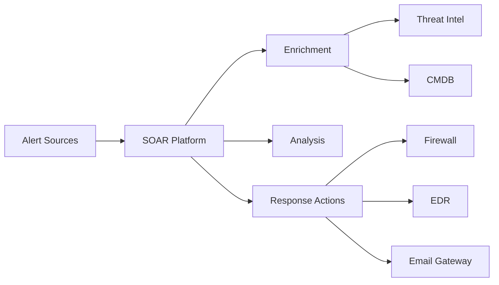

## Why Automate Incident Response?

Security teams are overwhelmed with alerts. Automation helps prioritize and respond to threats faster.

### Benefits of Automation

- **Speed**: Respond to incidents in seconds instead of minutes
- **Consistency**: Standardized response procedures
- **Scalability**: Handle more incidents with same team size
- **Reduced Burnout**: Less manual work for analysts

> **Stat**: Organizations with SOAR reduce incident response time by average of 73%.

## SOAR Architecture



## Building Automation Playbooks

### Playbook Structure

```yaml
playbook:
  name: "Phishing Email Response"
  trigger:
    type: email_alert
    conditions:
      - suspicious_sender
      - malicious_attachment

  steps:
    - name: enrich_email
      action: extract_indicators

    - name: check_threat_intel
      action: query_threat_feeds
      inputs:
        indicators: ${enrich_email.indicators}

    - name: decision_point
      type: conditional
      if: ${check_threat_intel.threat_score} > 7
      then: quarantine_email
      else: create_low_priority_ticket

    - name: quarantine_email
      action: email_gateway.quarantine

    - name: notify_user
      action: send_notification
```

### Example Automation Script

```python
#!/usr/bin/env python3
"""
Automated Phishing Response Playbook
"""

import requests
from datetime import datetime

class PhishingResponsePlaybook:
    def __init__(self, soar_config):
        self.soar = soar_config
        self.threat_threshold = 7.0

    def execute(self, alert):
        """Main playbook execution"""
        print(f"[{datetime.now()}] Starting phishing response playbook")

        # Step 1: Extract indicators
        indicators = self.extract_indicators(alert)

        # Step 2: Enrich with threat intelligence
        threat_score = self.check_threat_intel(indicators)

        # Step 3: Make response decision
        if threat_score >= self.threat_threshold:
            self.quarantine_email(alert['email_id'])
            self.block_sender(alert['sender'])
            self.notify_security_team(alert, threat_score)
        else:
            self.create_ticket(alert)

        # Step 4: Document response
        self.log_incident(alert, threat_score)

    def extract_indicators(self, alert):
        """Extract IOCs from email"""
        return {
            'sender': alert['sender'],
            'urls': alert.get('urls', []),
            'attachments': alert.get('attachments', []),
            'ip_addresses': alert.get('sender_ip')
        }

    def check_threat_intel(self, indicators):
        """Query threat intelligence feeds"""
        score = 0.0

        # Check sender domain
        if self.is_malicious_domain(indicators['sender']):
            score += 5.0

        # Check URLs
        for url in indicators['urls']:
            if self.is_malicious_url(url):
                score += 3.0

        return min(score, 10.0)

    def quarantine_email(self, email_id):
        """Quarantine malicious email"""
        print(f"🔒 Quarantining email: {email_id}")
        # Integration with email gateway

    def block_sender(self, sender):
        """Block sender at email gateway"""
        print(f"🚫 Blocking sender: {sender}")
        # Integration with email gateway
```

> **Warning**: Always test automation in a safe environment before deploying to production.

## Common Automation Use Cases

### 1. Malware Detection Response

```javascript
// Automated malware response
async function handleMalwareDetection(alert) {
  const actions = [];

  // Isolate infected endpoint
  actions.push(await isolateEndpoint(alert.hostname));

  // Collect forensic data
  actions.push(await collectMemoryDump(alert.hostname));

  // Check for lateral movement
  const relatedHosts = await findRelatedHosts(alert.hostname);

  // Create investigation case
  const caseId = await createCase({
    title: `Malware Detection: ${alert.malware_name}`,
    severity: "high",
    affected_hosts: [alert.hostname, ...relatedHosts],
  });

  return { caseId, actions };
}
```

### 2. Brute Force Attack Response

```python
def handle_brute_force(alert):
    """Respond to brute force attack"""

    # Block source IP
    block_ip_at_firewall(alert['source_ip'])

    # Force password reset if successful
    if alert['status'] == 'success':
        force_password_reset(alert['target_user'])
        notify_user(alert['target_user'])

    # Check for other attacks from same source
    related_attacks = find_related_attacks(alert['source_ip'])

    # Update threat intel
    submit_to_threat_feed({
        'indicator': alert['source_ip'],
        'type': 'ipv4',
        'threat_type': 'brute_force',
        'confidence': 90
    })
```

> **Note**: Always include manual approval steps for high-impact actions.

### 3. Data Leak Prevention

```typescript
interface DataLeakAlert {
  user: string;
  destination: string;
  dataClassification: "public" | "internal" | "confidential" | "restricted";
  fileSize: number;
}

async function handleDataLeak(alert: DataLeakAlert) {
  // Block the transfer
  await blockDataTransfer(alert);

  // Notify data owner
  await notifyDataOwner(alert);

  // If highly sensitive data
  if (alert.dataClassification === "restricted") {
    await escalateToManagement(alert);
    await disableUserAccount(alert.user);
  }

  // Create investigation
  return await createInvestigation({
    type: "data_leak",
    user: alert.user,
    severity: getSeverity(alert.dataClassification),
  });
}
```

## Integration Examples

### Integrating with Slack

```python
import requests

def send_slack_alert(incident):
    """Send incident notification to Slack"""
    webhook_url = "https://hooks.slack.com/services/YOUR/WEBHOOK/URL"

    message = {
        "blocks": [
            {
                "type": "header",
                "text": {
                    "type": "plain_text",
                    "text": f"🚨 Security Incident: {incident['title']}"
                }
            },
            {
                "type": "section",
                "fields": [
                    {"type": "mrkdwn", "text": f"*Severity:*\n{incident['severity']}"},
                    {"type": "mrkdwn", "text": f"*Status:*\n{incident['status']}"},
                    {"type": "mrkdwn", "text": f"*Analyst:*\n{incident['assigned_to']}"},
                    {"type": "mrkdwn", "text": f"*Time:*\n{incident['timestamp']}"}
                ]
            },
            {
                "type": "actions",
                "elements": [
                    {
                        "type": "button",
                        "text": {"type": "plain_text", "text": "View Incident"},
                        "url": incident['url'],
                        "style": "primary"
                    }
                ]
            }
        ]
    }

    response = requests.post(webhook_url, json=message)
    return response.status_code == 200
```

### API Integration Template

```bash
# Generic API call for integrations
curl -X POST https://api.example.com/v1/incidents \
  -H "Authorization: Bearer ${API_TOKEN}" \
  -H "Content-Type: application/json" \
  -d '{
    "title": "Security Incident",
    "severity": "high",
    "source": "SOAR Platform",
    "indicators": ["192.168.1.100", "malware.exe"]
  }'
```

## Best Practices

### 1. Start Small

Begin with simple, low-risk automations:

- Automated enrichment
- Alert deduplication
- Ticket creation

### 2. Include Human Oversight

```python
def requires_approval(action):
    """Determine if action requires human approval"""
    high_impact_actions = [
        'block_user',
        'shutdown_server',
        'modify_firewall_rule'
    ]
    return action in high_impact_actions
```

> **Important**: Never automate actions that could cause significant business disruption without approval gates.

### 3. Monitor and Measure

Track automation metrics:

```python
automation_metrics = {
    'playbooks_executed': 1247,
    'time_saved_hours': 312,
    'false_positive_rate': 0.08,
    'manual_interventions': 23,
    'success_rate': 0.96
}
```

### 4. Continuous Improvement

```python
def analyze_playbook_performance(playbook_id):
    """Analyze playbook effectiveness"""
    runs = get_playbook_runs(playbook_id)

    return {
        'total_runs': len(runs),
        'success_rate': sum(1 for r in runs if r.success) / len(runs),
        'avg_duration': mean([r.duration for r in runs]),
        'errors': [r for r in runs if r.error],
        'recommendations': generate_recommendations(runs)
    }
```

## Conclusion

SOAR platforms transform security operations by automating repetitive tasks and orchestrating complex responses. Start with simple use cases and gradually expand automation coverage.

> **Key Takeaway**: Automation amplifies your team's capabilities but doesn't replace human judgment.
