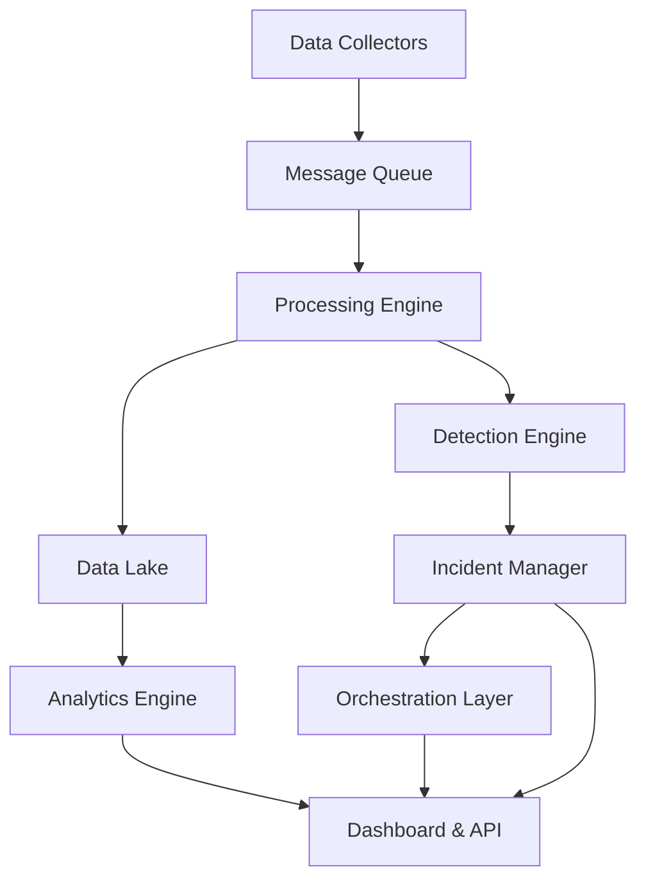

# Platform Architecture

Vinci is built on a modern, cloud-native architecture designed for scale, reliability, and performance. This guide explains the core components and how they work together.

## Architecture Overview



## Core Components

### Data Collection Layer

The data collection layer ingests security events from multiple sources:

**Collectors**

- **Agent-based collectors**: Lightweight agents deployed on endpoints
- **API collectors**: Pull data from cloud services and SaaS applications
- **Syslog receivers**: Accept standard syslog and CEF formatted logs
- **Cloud native integrations**: Native connectors for AWS, Azure, and GCP

**Features**

- High-throughput ingestion (100K+ events/sec)
- Automatic parsing and normalization
- Built-in buffering and retry logic
- TLS encryption for data in transit

### Message Queue

Apache Kafka serves as the central message bus:

- **Event streaming**: Real-time event distribution
- **Durability**: Configurable retention periods
- **Scalability**: Horizontal scaling by adding brokers
- **Topic organization**: Separate topics for different event types

**Topic Structure**

```
raw-events           # Unparsed incoming events
normalized-events    # Parsed and enriched events
alerts              # Triggered detection alerts
incidents           # Created security incidents
audit-logs          # System audit trail
```

### Processing Engine

The processing engine normalizes and enriches events:

**Normalization**

- Schema mapping to Common Information Model (CIM)
- Field extraction and type conversion
- Timestamp standardization to UTC
- Deduplication of identical events

**Enrichment**

- GeoIP lookups for IP addresses
- DNS resolution and reverse DNS
- Asset inventory correlation
- User directory integration (Active Directory, LDAP)
- Threat intelligence lookups

### Detection Engine

The detection engine identifies security threats using multiple techniques:

#### Rule-Based Detection

Sigma-compatible rules written in YAML:

```yaml
title: Suspicious PowerShell Execution
status: production
description: Detects PowerShell commands with encoded parameters
logsource:
  category: process_creation
  product: windows
detection:
  selection:
    Image|endswith: '\powershell.exe'
    CommandLine|contains:
      - "-enc"
      - "-encodedcommand"
  condition: selection
falsepositives:
  - Legitimate admin scripts
level: medium
```

#### Machine Learning Detection

Built-in ML models for anomaly detection:

- **User behavior analytics (UBA)**: Detects unusual user activity
- **Entity behavior analytics (UEBA)**: Identifies compromised accounts
- **Network anomaly detection**: Finds unusual network patterns
- **Time-series forecasting**: Predicts normal baselines

#### Correlation Engine

Multi-event correlation for complex attack patterns:

```python
# Example correlation rule
rule = CorrelationRule(
    name="Credential Stuffing Attack",
    events=[
        Event("failed_login", count=10, timeframe="5m"),
        Event("successful_login", from_different_geo=True)
    ],
    group_by=["user_id"],
    severity="high"
)
```

### Incident Management

Centralized incident lifecycle management:

**Workflow Stages**

1. **New**: Alert has been created
2. **Triaged**: Initial assessment completed
3. **Investigating**: Active investigation in progress
4. **Contained**: Threat has been isolated
5. **Resolved**: Incident fully remediated
6. **Closed**: Post-incident review completed

**Features**

- Automated assignment based on rules
- SLA tracking and escalation
- Case collaboration tools
- Evidence collection and chain of custody
- Integration with ticketing systems (Jira, ServiceNow)

### Orchestration Layer

SOAR (Security Orchestration, Automation, and Response) capabilities:

**Playbook Engine**

- Visual playbook designer
- 100+ pre-built integrations
- Conditional logic and branching
- Human approval gates
- Parallel execution support

**Common Playbook Actions**

- Query threat intelligence feeds
- Isolate compromised endpoints
- Block malicious IPs at firewall
- Disable user accounts
- Create support tickets
- Send notifications (email, Slack, PagerDuty)

### Data Lake

Long-term storage for all security events:

**Storage Options**

- **Hot storage**: Last 30 days on SSD (fast queries)
- **Warm storage**: 31-365 days on HDD (moderate speed)
- **Cold storage**: 1+ years on object storage (archival)

**Retention Policies**

- Configurable per event type
- Automatic data lifecycle management
- Compliance-ready retention (7 years for regulated industries)
- Data encryption at rest (AES-256)

### Analytics Engine

Advanced analytics and reporting:

**Query Engine**

- SQL-like query language (SPL)
- Full-text search powered by Elasticsearch
- Aggregations and statistical functions
- Saved searches and scheduled reports

**Visualization**

- Real-time dashboards
- Custom chart types (line, bar, pie, heatmap)
- Geospatial mapping
- Timeline visualizations

**Machine Learning**

- Jupyter notebook integration
- Custom model training
- Model deployment pipeline
- A/B testing framework

### API & Dashboard

User-facing interfaces:

**REST API**

- OpenAPI 3.0 specification
- JWT authentication
- Rate limiting and quotas
- Webhook support

**Web Dashboard**

- React-based SPA
- Real-time updates via WebSocket
- Role-based access control
- Dark/light themes
- Mobile responsive

## Deployment Architectures

### Single Server (Development)

Suitable for testing and small deployments (&lt;1K events/sec):

```yaml
services:
  - postgres
  - redis
  - kafka (single broker)
  - vinci-all-in-one
```

**Resources**: 8GB RAM, 4 CPU cores, 100GB storage

### High Availability (Production)

For enterprise deployments (10K-100K events/sec):

```
Load Balancer
├── Web Tier (3+ nodes)
├── API Tier (3+ nodes)
├── Processing Tier (5+ nodes)
├── Detection Tier (3+ nodes)
└── Kafka Cluster (3+ brokers)

Shared Services
├── PostgreSQL Cluster (Primary + 2 Replicas)
├── Redis Cluster (3+ nodes)
└── Elasticsearch Cluster (3+ nodes)

Storage
├── S3-compatible Object Storage
└── NFS/EBS for shared files
```

**Resources**: Auto-scaling based on load

### Cloud-Native (Kubernetes)

Deploy on any Kubernetes cluster:

```bash
helm repo add vinci https://charts.vinci-soc.io
helm install vinci vinci/vinci-soc \
  --set replicas.web=3 \
  --set replicas.api=3 \
  --set replicas.workers=5
```

**Features**

- Horizontal pod autoscaling
- Rolling updates with zero downtime
- Health checks and self-healing
- Distributed tracing with Jaeger

## Security Considerations

### Authentication & Authorization

- **Multi-factor authentication (MFA)**: TOTP, WebAuthn, SMS
- **SSO integration**: SAML 2.0, OAuth 2.0, OpenID Connect
- **Role-based access control (RBAC)**: Fine-grained permissions
- **API key management**: Rotating keys with expiration

### Network Security

- **TLS 1.3**: All communications encrypted
- **Certificate pinning**: Prevent MITM attacks
- **Network segmentation**: Isolate components
- **Firewall rules**: Minimal required ports

### Data Protection

- **Encryption at rest**: AES-256 for all stored data
- **Encryption in transit**: TLS 1.3 with strong ciphers
- **Key management**: Integration with HashiCorp Vault
- **Data masking**: PII/PCI data redaction
- **Audit logging**: Comprehensive audit trail

## Performance Optimization

### Tuning Parameters

```yaml
# config/performance.yml
ingestion:
  batch_size: 1000
  batch_timeout: 5s
  workers: 10

processing:
  threads_per_worker: 4
  queue_size: 10000

detection:
  rule_check_interval: 1s
  max_parallel_rules: 50

database:
  connection_pool: 20
  query_timeout: 30s
```

### Monitoring

Key metrics to track:

- **Ingestion rate**: Events per second
- **Processing latency**: Time from ingestion to detection
- **Detection coverage**: % of events analyzed
- **False positive rate**: Alerts vs. true incidents
- **System resources**: CPU, memory, disk I/O

## Disaster Recovery

### Backup Strategy

- **Database backups**: Daily full + hourly incremental
- **Configuration backups**: Automated Git commits
- **Log archival**: Continuous replication to S3
- **Retention**: 30 days hot, 365 days cold

### Recovery Procedures

1. **Database restoration**: From most recent backup
2. **Configuration replay**: Restore from Git
3. **Service restart**: Automated health checks
4. **Data reprocessing**: Replay events from Kafka

**RTO (Recovery Time Objective)**: < 4 hours  
**RPO (Recovery Point Objective)**: < 1 hour

## Next Steps

<Cards>
  <Card title="Deployment Guide" href="/docs/deployment">
    Learn how to deploy Vinci in your environment
  </Card>
  <Card title="Configuration" href="/docs/configuration">
    Configure platform settings and parameters
  </Card>
  <Card title="API Reference" href="/docs/api-reference">
    Explore the REST API documentation
  </Card>
</Cards>
