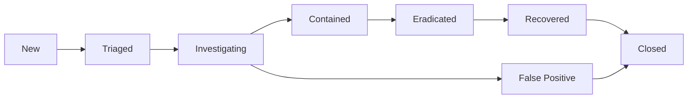

# Incident Management

Vinci's incident management system provides a complete workflow for handling security incidents from detection through resolution. This guide covers incident lifecycles, case management, and response automation.

## Incident Lifecycle

### Workflow Stages

Every incident progresses through defined stages:



#### Stage Definitions

| Stage             | Description                                  | Typical Actions                          | SLA      |
| ----------------- | -------------------------------------------- | ---------------------------------------- | -------- |
| **New**           | Alert has been created                       | Initial review, severity assessment      | 15 min   |
| **Triaged**       | Incident validated and prioritized           | Assignment, scope definition             | 1 hour   |
| **Investigating** | Active analysis in progress                  | Evidence collection, root cause analysis | 4 hours  |
| **Contained**     | Threat isolated and prevented from spreading | System isolation, account disablement    | 2 hours  |
| **Eradicated**    | Threat completely removed                    | Malware removal, patch application       | 8 hours  |
| **Recovered**     | Systems restored to normal                   | Service restoration, monitoring          | 24 hours |
| **Closed**        | Post-incident review completed               | Documentation, lessons learned           | 48 hours |

### Severity Levels

Incidents are classified by severity:

#### Critical (P1)

- **Definition**: Active threat with widespread impact
- **Examples**: Ransomware outbreak, data breach, system compromise
- **Response Time**: Immediate (24/7 response)
- **Escalation**: SOC Manager, CISO notified immediately
- **Resources**: All hands on deck, external resources if needed

#### High (P2)

- **Definition**: Serious threat with limited scope
- **Examples**: Single system compromise, targeted attack, privilege escalation
- **Response Time**: Within 1 hour
- **Escalation**: SOC Manager notified
- **Resources**: Senior analyst assigned

#### Medium (P3)

- **Definition**: Suspicious activity requiring investigation
- **Examples**: Policy violations, failed attack attempts, unusual behavior
- **Response Time**: Within 4 hours
- **Escalation**: Team lead notified
- **Resources**: Tier 2 analyst assigned

#### Low (P4)

- **Definition**: Informational events or minor issues
- **Examples**: Reconnaissance attempts, known false positives
- **Response Time**: Next business day
- **Escalation**: None required
- **Resources**: Tier 1 analyst or automated handling

## Creating Incidents

### Automatic Creation

Incidents are automatically created when detection rules trigger:

```yaml
detection_rule:
  name: "Brute Force Attack Detected"
  severity: high
  incident_creation:
    enabled: true
    title: "Brute Force Attack from ${source_ip}"
    description: |
      Multiple failed login attempts detected:
      - Source IP: ${source_ip}
      - Target User: ${target_user}
      - Attempt Count: ${attempt_count}
      - Time Window: ${timeframe}
    severity: high
    assign_to: "tier2_analysts"
    tags:
      - brute_force
      - authentication
      - mitre_t1110
    playbook: "brute_force_response"
```

### Manual Creation

Security analysts can create incidents manually:

```javascript
// Create incident via API
const incident = await vinci.incidents.create({
  title: "Suspicious Email Campaign Investigation",
  description:
    "Multiple users reported receiving suspicious emails with unexpected attachments",
  severity: "medium",
  type: "phishing",
  affected_assets: ["email-server-01", "user-mailboxes"],
  affected_users: ["john.doe@company.com", "jane.smith@company.com"],
  tags: ["phishing", "email", "social_engineering"],
  custom_fields: {
    campaign_id: "PHISH-2026-001",
    email_subject: "Urgent: Password Reset Required",
  },
});

console.log(`Incident created: ${incident.id}`);
```

### Incident Templates

Pre-defined templates for common scenarios:

```yaml
templates:
  - name: "Ransomware Response"
    severity: critical
    type: malware
    checklist:
      - title: "Isolate affected systems"
        required: true
      - title: "Identify ransomware variant"
        required: true
      - title: "Check for backups"
        required: true
      - title: "Contact legal/PR teams"
        required: false
      - title: "Assess decryption options"
        required: true
    playbooks:
      - ransomware_containment
      - data_recovery
    notifications:
      - soc_manager
      - ciso
      - legal_team

  - name: "Data Exfiltration"
    severity: high
    type: data_breach
    checklist:
      - title: "Identify data classification"
        required: true
      - title: "Block egress channels"
        required: true
      - title: "Preserve evidence"
        required: true
      - title: "Determine regulatory requirements"
        required: true
    playbooks:
      - data_loss_prevention
      - forensic_collection
```

## Case Management

### Incident Details

Each incident contains comprehensive information:

```typescript
interface Incident {
  // Core Information
  id: string;
  title: string;
  description: string;
  severity: "critical" | "high" | "medium" | "low";
  status: "new" | "triaged" | "investigating" | "contained" | "resolved";

  // Classification
  type: string; // e.g., 'malware', 'phishing', 'intrusion'
  category: string; // e.g., 'cyber_attack', 'policy_violation'
  mitre_tactics: string[]; // ATT&CK tactics
  mitre_techniques: string[]; // ATT&CK techniques

  // Assignment
  assigned_to: string;
  team: string;
  watchers: string[];

  // Timing
  created_at: Date;
  updated_at: Date;
  first_detected: Date;
  triaged_at?: Date;
  contained_at?: Date;
  resolved_at?: Date;

  // Scope
  affected_assets: Asset[];
  affected_users: User[];
  affected_locations: string[];

  // Related Data
  alerts: Alert[];
  events: SecurityEvent[];
  artifacts: Evidence[];
  related_incidents: string[];

  // Response
  playbooks_executed: Playbook[];
  actions_taken: Action[];
  notes: Note[];

  // Metadata
  tags: string[];
  custom_fields: Record<string, any>;
  sla_status: SLAStatus;
}
```

### Investigation Workspace

Interactive workspace for investigations:

```javascript
// Open investigation workspace
const investigation = await vinci.investigations.open(incident.id);

// Query related events
const events = await investigation.query(`
  source_ip:${incident.source_ip} OR dest_ip:${incident.source_ip}
  | where timestamp >= ${incident.first_detected} - 1h
  | where timestamp <= ${incident.first_detected} + 1h
  | sort timestamp asc
`);

// Timeline visualization
const timeline = await investigation.buildTimeline({
  events: events,
  group_by: "user",
  highlight: ["authentication", "network", "file_activity"],
});

// Add evidence
await investigation.addEvidence({
  type: "network_capture",
  file: "suspicious-traffic.pcap",
  description: "Packet capture showing C2 communication",
  hash: "sha256:abc123...",
  collected_by: "analyst@company.com",
  collected_at: new Date(),
});

// Add notes
await investigation.addNote({
  text: "Source IP resolves to known APT infrastructure",
  attachments: ["threat-intel-report.pdf"],
  private: false,
});
```

### Collaboration Features

#### Comments and Notes

```javascript
// Add comment
await vinci.incidents.addComment(incident.id, {
  text: "Identified malicious PowerShell script in user's temp directory",
  mentions: ["@senior.analyst", "@soc.manager"],
  attachments: ["malicious-script.ps1"],
  tags: ["powershell", "malware"],
});

// Private notes (only visible to assigned team)
await vinci.incidents.addNote(incident.id, {
  text: "User may be insider threat - handle carefully",
  private: true,
  visibility: ["tier3_analysts", "soc_manager"],
});
```

#### Task Management

```javascript
// Create subtasks
await vinci.incidents.createTask(incident.id, {
  title: "Check all systems for similar indicators",
  assigned_to: "threat.hunter@company.com",
  due_date: new Date(Date.now() + 4 * 60 * 60 * 1000), // 4 hours
  priority: "high",
  checklist: [
    "Search for file hash across endpoints",
    "Check network logs for C2 communication",
    "Review user activity logs",
    "Document findings",
  ],
});
```

#### Real-time Collaboration

```javascript
// Subscribe to incident updates
vinci.incidents.subscribe(incident.id, (update) => {
  console.log(`Incident updated: ${update.type}`);

  switch (update.type) {
    case "comment":
      notify(`New comment from ${update.author}`);
      break;
    case "status_change":
      notify(`Status changed to ${update.new_status}`);
      break;
    case "escalation":
      alert(`Incident escalated to ${update.severity}`);
      break;
  }
});
```

## Response Actions

### Manual Actions

Common response actions available in the UI:

```yaml
response_actions:
  network:
    - name: "Block IP Address"
      description: "Add IP to firewall blocklist"
      parameters:
        - ip_address
        - duration
        - scope: [perimeter, internal, all]

    - name: "Isolate Host"
      description: "Remove system from network"
      parameters:
        - hostname
        - preserve_connection: boolean

  endpoint:
    - name: "Kill Process"
      description: "Terminate malicious process"
      parameters:
        - hostname
        - process_id
        - force: boolean

    - name: "Quarantine File"
      description: "Move file to quarantine"
      parameters:
        - hostname
        - file_path

  identity:
    - name: "Disable Account"
      description: "Disable user account"
      parameters:
        - username
        - revoke_sessions: boolean

    - name: "Reset Password"
      description: "Force password reset"
      parameters:
        - username
        - notify_user: boolean
```

### Automated Response

Playbooks automate common response workflows:

```javascript
// Define response playbook
const playbook = {
  name: "Malware Containment",
  trigger: "incident.type == 'malware' AND severity >= 'high'",
  steps: [
    {
      name: "Isolate Host",
      action: "endpoint.isolate",
      parameters: {
        hostname: "{{incident.affected_assets[0]}}",
        preserve_management: true,
      },
      approval_required: false,
    },
    {
      name: "Collect Forensics",
      action: "forensics.collect",
      parameters: {
        hostname: "{{incident.affected_assets[0]}}",
        artifacts: ["memory", "disk", "processes", "network"],
      },
      approval_required: false,
    },
    {
      name: "Scan All Endpoints",
      action: "endpoint.scan",
      parameters: {
        ioc_type: "file_hash",
        ioc_value: "{{incident.indicators.file_hash}}",
        scope: "all",
      },
      approval_required: false,
    },
    {
      name: "Disable User Account",
      action: "identity.disable",
      parameters: {
        username: "{{incident.affected_users[0]}}",
      },
      approval_required: true, // Requires human approval
      approvers: ["soc.manager@company.com"],
    },
    {
      name: "Create Support Ticket",
      action: "integration.jira.create",
      parameters: {
        project: "SECURITY",
        issue_type: "Incident",
        summary: "{{incident.title}}",
        priority: "{{incident.severity}}",
      },
      approval_required: false,
    },
  ],
  notifications: {
    on_start: ["soc-team@company.com"],
    on_approval: ["soc.manager@company.com"],
    on_complete: ["soc-team@company.com", "{{incident.assigned_to}}"],
    on_failure: ["soc.manager@company.com"],
  },
};

// Execute playbook
const execution = await vinci.playbooks.execute(playbook.name, {
  incident_id: incident.id,
  parameters: {
    // Override default parameters if needed
  },
});
```

## Evidence Management

### Chain of Custody

Maintain proper evidence handling:

```javascript
// Collect evidence
const evidence = await vinci.evidence.collect({
  incident_id: incident.id,
  type: "disk_image",
  source: {
    hostname: "compromised-server-01",
    volume: "/dev/sda1",
  },
  method: "dd",
  collector: "forensics@company.com",
  witness: "manager@company.com",
  notes: "Full disk image collected for forensic analysis",
});

// Evidence is automatically:
// - Hashed (SHA-256)
// - Timestamped
// - Logged to audit trail
// - Stored securely with encryption

// Transfer custody
await vinci.evidence.transfer({
  evidence_id: evidence.id,
  from: "forensics@company.com",
  to: "legal@company.com",
  reason: "Legal review requested",
  witness: "manager@company.com",
});

// Export for external analysis
await vinci.evidence.export({
  evidence_id: evidence.id,
  format: "encase",
  destination: "/mnt/secure/exports/",
  password_protect: true,
  audit_log: true,
});
```

### Digital Forensics

Built-in forensic tools:

```bash
# Memory analysis
vinci forensics analyze-memory \
  --incident-id INC-2026-001 \
  --file memory-dump.raw \
  --profile Win10x64 \
  --plugins pslist,netscan,malfind

# Disk analysis
vinci forensics analyze-disk \
  --incident-id INC-2026-001 \
  --image disk-image.dd \
  --timeline \
  --file-recovery \
  --malware-scan

# Network forensics
vinci forensics analyze-pcap \
  --incident-id INC-2026-001 \
  --file capture.pcap \
  --extract-files \
  --identify-c2
```

## Metrics and Reporting

### Incident Metrics

Track key performance indicators:

```javascript
// Get incident metrics
const metrics = await vinci.incidents.getMetrics({
  timeframe: "30d",
  group_by: "severity",
});

console.log(`
Incident Statistics (Last 30 Days):
- Total Incidents: ${metrics.total}
- Open Incidents: ${metrics.open}
- Closed Incidents: ${metrics.closed}

By Severity:
- Critical: ${metrics.by_severity.critical}
- High: ${metrics.by_severity.high}
- Medium: ${metrics.by_severity.medium}
- Low: ${metrics.by_severity.low}

Response Times:
- Mean Time to Detect (MTTD): ${metrics.mttd}
- Mean Time to Acknowledge (MTTA): ${metrics.mtta}
- Mean Time to Contain (MTTC): ${metrics.mttc}
- Mean Time to Resolve (MTTR): ${metrics.mttr}

SLA Compliance: ${metrics.sla_compliance}%
`);
```

### Incident Reports

Generate comprehensive reports:

```javascript
// Post-incident report
const report = await vinci.incidents.generateReport(incident.id, {
  template: "post_incident_review",
  sections: [
    "executive_summary",
    "timeline",
    "root_cause_analysis",
    "impact_assessment",
    "response_actions",
    "lessons_learned",
    "recommendations",
  ],
  format: "pdf",
  include_evidence: true,
  redact_sensitive: false,
});

// Trend analysis report
const trends = await vinci.reports.generate({
  type: "incident_trends",
  timeframe: "90d",
  metrics: [
    "incident_count",
    "severity_distribution",
    "response_times",
    "attack_vectors",
    "affected_assets",
  ],
  format: "html",
});
```

## Integration with Ticketing Systems

### ServiceNow Integration

```yaml
integrations:
  servicenow:
    enabled: true
    instance_url: "https://company.service-now.com"
    username: "${SERVICENOW_USER}"
    password: "${SERVICENOW_PASS}"

    mapping:
      incident_to_ticket:
        severity:
          critical: 1
          high: 2
          medium: 3
          low: 4
        priority:
          critical: 1
          high: 2
          medium: 3
          low: 4
        category: "Security Incident"
        assignment_group: "SOC Team"

    sync:
      bidirectional: true
      sync_comments: true
      sync_attachments: true
      close_on_resolve: true
```

### Jira Integration

```javascript
// Automatically create Jira tickets
await vinci.integrations.jira.configure({
  url: "https://company.atlassian.net",
  email: "soc@company.com",
  api_token: process.env.JIRA_API_TOKEN,

  auto_create: {
    enabled: true,
    conditions: "severity >= 'high'",
    project: "SEC",
    issue_type: "Incident",
    mapping: {
      summary: "{{incident.title}}",
      description: "{{incident.description}}",
      priority: "{{incident.severity}}",
      labels: "{{incident.tags}}",
    },
  },
});
```

## Best Practices

### Incident Response

1. **Speed over perfection**: Quick containment beats perfect analysis
2. **Document everything**: Notes, actions, decisions, timelines
3. **Communicate clearly**: Keep stakeholders informed
4. **Preserve evidence**: Maintain chain of custody
5. **Learn and improve**: Conduct post-incident reviews

### Common Pitfalls

❌ **Don't:**

- Delay containment waiting for perfect information
- Modify systems without documenting changes
- Close incidents without root cause analysis
- Ignore minor incidents (they may be indicators)
- Skip post-incident reviews

✅ **Do:**

- Follow established playbooks
- Escalate early when needed
- Maintain detailed timeline
- Preserve evidence properly
- Share lessons learned

## Next Steps

<Cards>
  <Card title="Playbooks" href="/docs/playbooks">
    Create automated response workflows
  </Card>
  <Card title="Integrations" href="/docs/integrations">
    Connect external tools and services
  </Card>
  <Card title="Forensics" href="/docs/forensics">
    Advanced forensic analysis techniques
  </Card>
</Cards>
